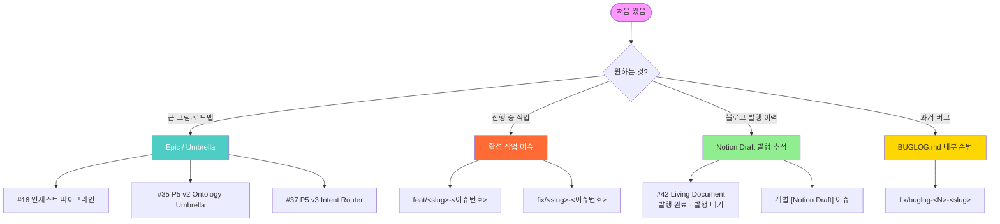
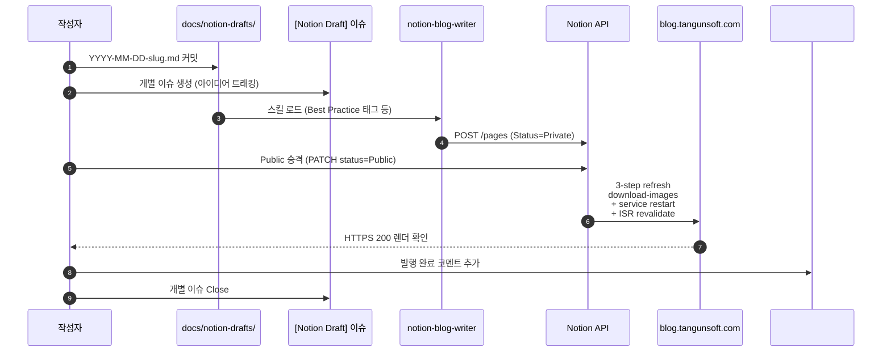

# RAG service for llm.tangunsoft.com

작은 사내 LLM 서비스(Qwen2.5-7B via vLLM + LiteLLM)에 붙인 검색-증강 생성(RAG) 계층.

## 구성

```
클라이언트 ──HTTPS──▶ Apache :443 (llm.tangunsoft.com)
                       │
                       ├── /rag/*   ──▶ RAG service :8100  ──▶ Chroma (파일)
                       │                       │             └▶ multilingual-e5-base (CPU 임베딩)
                       │                       └──▶ LiteLLM :4000 ──▶ vLLM :8000 (Qwen2.5-7B, GPU)
                       │
                       └── /*       ──▶ LiteLLM :4000 (기존 OpenAI API 그대로)
```

기존 LiteLLM/vLLM 경로는 **한 줄도 안 건드림**. Apache에 `/rag/` ProxyPass 한 블록만 추가.

## 서버 배치

| 위치 | 용도 |
|---|---|
| `/upload/rag/venv/` | Python 3.11 venv (torch CPU-only + fastapi + chromadb + sentence-transformers) |
| `/upload/rag/app/` | 애플리케이션 코드 |
| `/upload/rag/data/chroma/` | 벡터 DB (파일 기반, 백업 시 tar만 뜨면 됨) |
| `/upload/rag/data/docs.json` | 문서 등록 인덱스 (사이드카 JSON) |
| `/upload/rag/models/` | HF 모델 캐시 (multilingual-e5-base ≈ 1.1GB) |
| `/upload/rag/rag.env` | 시크릿 + 튜닝 파라미터 (600 권한) |
| `/upload/rag/logs/` | 초기 설치/모델 다운로드 로그 (런타임은 journald) |
| `/etc/systemd/system/rag.service` | systemd 유닛 (`After=litellm.service`) |
| `/etc/httpd/conf.d/litellm.conf` | `/rag/` ProxyPass 라인 추가 (원본은 `.pre-rag.*.bak`으로 보존) |

## 리소스 사용량

- **GPU**: 0 (vLLM 방해 금지 — 임베딩은 전부 CPU)
- **CPU**: 4 vCPU 중 최대 3.5 vCPU (`CPUQuota=350%`)
- **메모리**: `MemoryMax=6G`, 실측 startup 후 ≈ 215MB, 임베딩 배치 시 ≈ 1GB
- **디스크**: 모델 1.1GB + Chroma 데이터 (문서 크기에 비례)

## API

인증: 기본 비활성. 활성화하려면 `/upload/rag/rag.env` 에 `API_KEY=...` 추가 후
`sudo systemctl restart rag.service`. 활성화 시 `/rag/health` 를 제외한 모든
엔드포인트가 `X-API-Key` 헤더를 요구.

### 문서 넣기

```bash
# 텍스트
curl -X POST https://llm.tangunsoft.com/rag/ingest/text \
  -H "Content-Type: application/json" \
  -d '{"source":"policy.md","text":"...","metadata":{"team":"sec"}}'

# 파일 업로드 (PDF/TXT/MD/코드 등)
curl -X POST https://llm.tangunsoft.com/rag/ingest/file \
  -F "file=@handbook.pdf" \
  -F "source=handbook.pdf"

# URL
curl -X POST https://llm.tangunsoft.com/rag/ingest/url \
  -H "Content-Type: application/json" \
  -d '{"url":"https://example.com/faq"}'
```

### 검색만 (LLM 호출 없음, 빠름)

```bash
curl -X POST https://llm.tangunsoft.com/rag/search \
  -H "Content-Type: application/json" \
  -d '{"query":"보안 정책 요약","k":5}'
```

### 원샷 RAG (검색 + 생성 + 인용)

```bash
curl -X POST https://llm.tangunsoft.com/rag/query \
  -H "Content-Type: application/json" \
  -d '{"query":"우리 회사 보안 정책 요약해줘","k":5,"max_tokens":400}'
```

응답:
```json
{
  "query": "...",
  "answer": "...본문에는 [1] 이런 인용이 포함됩니다...",
  "citations": [{"n":1,"doc_id":"...","source":"policy.md","score":0.89,"snippet":"..."}],
  "model": "qwen2.5-7b"
}
```

### OpenAI SDK 호환

기존 OpenAI 클라이언트가 그대로 붙습니다. base URL만 바꾸면 됨:

```python
from openai import OpenAI
client = OpenAI(
    base_url="https://llm.tangunsoft.com/rag/v1",
    api_key="sk-litellm-...",  # LITELLM_MASTER_KEY (인증 켜면 X-API-Key 도 추가)
)
resp = client.chat.completions.create(
    model="qwen2.5-7b",
    messages=[{"role":"user","content":"우리 회사 소개해줘"}],
    extra_body={"rag": True, "rag_k": 5},   # RAG on
)
print(resp.choices[0].message.content)
```

- `rag: true` (기본) → 마지막 user 메시지로 검색 → 컨텍스트 주입 → 응답에 `citations` 필드 추가
- `rag: false` → 순수 패스스루 (RAG 오프, LiteLLM 그대로)
- `stream: true` 도 지원 (SSE 그대로 흘려보냄)

### 문서 관리

```bash
curl https://llm.tangunsoft.com/rag/docs          # 목록
curl -X DELETE https://llm.tangunsoft.com/rag/docs/{doc_id}
curl https://llm.tangunsoft.com/rag/stats         # 문서/청크 카운트
curl https://llm.tangunsoft.com/rag/health        # 헬스
```

## 튜닝 포인트 (`/upload/rag/rag.env`)

| key | 기본값 | 설명 |
|---|---|---|
| `EMBED_MODEL_NAME` | `intfloat/multilingual-e5-base` | 다른 e5 계열로 교체 시 `models_dir` 새로 다운로드됨 |
| `CHUNK_SIZE` / `CHUNK_OVERLAP` | 800 / 120 chars | CJK 문장 기준; 영문 위주면 1200/150도 무난 |
| `TOP_K` | 5 | 검색 반환 개수 |
| `MIN_SCORE` | 0.0 | 코사인 유사도 컷오프 (0.4~0.6 정도로 올리면 노이즈 감소) |
| `RAG_TEMPERATURE` | 0.2 | 답변 결정성. 창의성 필요하면 0.7 |
| `RAG_MAX_TOKENS` | 1024 | 응답 최대 길이 |
| `DEFAULT_MODEL` | `qwen2.5-7b` | LiteLLM 모델 이름과 일치해야 함 |

바꾼 뒤: `sudo systemctl restart rag.service`

## 운영 명령

```bash
sudo systemctl status  rag.service
sudo systemctl restart rag.service
sudo systemctl stop    rag.service
sudo journalctl -u rag.service -f      # 실시간 로그
sudo journalctl -u rag.service -n 200
```

Apache 변경 후:
```bash
sudo httpd -t && sudo systemctl reload httpd
```

롤백:
```bash
sudo cp /etc/httpd/conf.d/litellm.conf.pre-rag.*.bak /etc/httpd/conf.d/litellm.conf
sudo systemctl reload httpd
sudo systemctl stop rag.service && sudo systemctl disable rag.service
```

## 검증

로컬(서버 안):
```bash
BASE=http://127.0.0.1:8100 ./scripts/smoke_test.sh
```

외부(HTTPS):
```bash
BASE=https://llm.tangunsoft.com ./scripts/smoke_test.sh
```

## 알려진 이슈

1. **Rocky 9 SQLite 3.34 vs Chroma 요구 3.35+**
   `app/__init__.py` 에서 `pysqlite3-binary` 를 `sys.modules["sqlite3"]` 으로
   스왑. Chroma 임포트보다 항상 먼저 실행됨.

2. **Chroma posthog telemetry 오류 로그**
   `capture() takes 1 positional argument but 3 were given` — 최신 posthog SDK
   시그니처 변경 때문이며 실제 동작에는 영향 없음. `anonymized_telemetry=False`
   로 이미 꺼놓았지만 라이브러리가 완전 무시하진 않아서 로그만 남음.

3. **GPU 사용 안 함**
   L4 24GB 중 21GB가 vLLM에 잡혀 있어서 임베딩까지 GPU에 올리면 vLLM이
   OOM. 따라서 임베딩은 CPU 고정. 문서 인제스트 처리량은 4 vCPU 기준
   대략 초당 3~5 청크. 대량 배치 필요하면 `EMBED_BATCH_SIZE` 를 키우고
   여유 있는 시간대에 백그라운드로 넣는 것 권장.

## 관련 문서

- [`docs/ARCHITECTURE.md`](docs/ARCHITECTURE.md) — 시스템 아키텍처 상세 설명 (개념/구조/흐름/용어)
- [`docs/DESIGN_PRINCIPLES.md`](docs/DESIGN_PRINCIPLES.md) — 자동 인제스트 파이프라인 설계 원칙 (Dumb Server, Smart Client)
- [`docs/BUGLOG.md`](docs/BUGLOG.md) — 프로젝트 내부 버그 트래킹 (GitHub 이슈와 별개, `#1, #2, ...` 순번)
- 블로그 [사내 RAG 완전 구축기](https://blog.tangunsoft.com/rag-setup-fastapi-chroma-vllm) — 전체 구축 여정 (Post 1)
- 블로그 [자동 인제스트 파이프라인 - Dumb Server, Smart Client](https://blog.tangunsoft.com/rag-dumb-server-smart-client) — 설계 원칙 상세 (Post 2)

## 이슈 관리 구조

전체 이슈 리스트: [`Issues`](../../issues?q=is%3Aissue)

### 이슈 진입 지도



### 이슈 종류별 진입점

- **Epic / Umbrella 로드맵** — 여러 sub-issue 를 묶는 상위 트래킹
  - [Epic #16](../../issues/16) — 데이터 인제스트 자동화 파이프라인 4단계 로드맵
  - [#35](../../issues/35) — [P5 v2] Tangunsoft Business Ontology (Umbrella)
  - [#37](../../issues/37) — P5 v3 Intent Router (RAG/Ontology 자동 라우팅)
  - [#42](../../issues/42) — **Notion Draft → Blog 발행 추적** (Living Document — 모든 블로그 발행 상태가 여기 모임)

- **작업 이슈 (feature / bug)** — 단일 스코프 구현. 브랜치와 1:1 매칭
  - 브랜치 명명: `feat/<slug>-<이슈번호>` (예: `feat/intent-router-37`) 또는 `fix/<slug>-<이슈번호>`
  - 이슈 close = 브랜치 병합 완료 + main 반영 확인

- **Notion Draft 이슈** — 블로그 게시 후보 아이디어 트래킹
  - 형식: `[Notion Draft] <제목>`
  - Draft 파일 위치: `docs/notion-drafts/YYYY-MM-DD-slug.md`
  - 워크플로우: 초안 커밋 → Notion 게시 (`notion-blog-writer` skill) → `#42` tracker 이관 → draft 이슈 close
  - 자동 close 아님. 발행 후 수동 close 필요.

- **BUGLOG 내부 항목** — `docs/BUGLOG.md` 의 순번 (`#1, #2, ...`)
  - GitHub 이슈와 **별개** 트래킹 (프로젝트 내부 running journal)
  - 브랜치 명명: `fix/buglog-N-<slug>` (예: `fix/buglog-6-and-tool-coverage` → BUGLOG.md `#6 Chroma HNSW ...` 항목 해결)

### Notion Draft → 블로그 발행 워크플로우



### 처음 왔으면 여기부터

1. **뭐가 진행 중인지**: [Issues (Open)](../../issues?q=is%3Aissue+is%3Aopen)
2. **로드맵 큰 그림**: [Epic #16](../../issues/16), [#35](../../issues/35), [#37](../../issues/37)
3. **블로그 발행 이력·대기**: [#42 tracker](../../issues/42) body 를 열면 상단 = 발행 완료, 하단 = 대기 리스트
4. **최근 해결한 버그**: [`docs/BUGLOG.md`](docs/BUGLOG.md)
